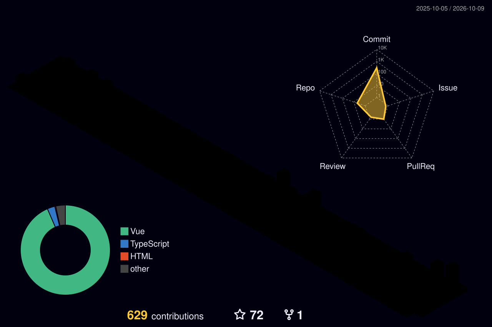

<!--
  SERGIO LOPEZ / GITHUB PROFILE
  Theme: MIDNIGHT CYAN x VIOLET
  Reemplaza la URL del GIF por ./assets/developer.gif cuando lo descargues.
-->

<table>
<tr>
<td width="62%" valign="top">

### `> whoami`

Software Development Engineering graduate from **El Salvador**. I design and build backend services, cloud-native applications and mobile experiences — from APIs and distributed systems to delivery pipelines.

- **Backend:** Java / Spring Boot, NestJS, Node.js, TypeScript.
- **Cloud:** GCP, AWS, Docker, Kubernetes, CI/CD.
- **Mobile & Web:** React Native, Expo, Angular, React, Vue, Nuxt.
- **Focus:** Microservices, authentication, databases, integrations and system architecture.
- **Exploring:** Blockchain-backed document verification and developer automation.

</td>
<td width="38%" align="center" valign="middle">

</td>
</tr>
</table>

**Backend & Languages**

**Web & Mobile**

**Cloud, Data & Engineering**

 

 

<!-- Tu workflow 3D debe regenerar este SVG periódicamente. -->

<!-- La rama output se crea después de ejecutar correctamente la GitHub Action de la snake. -->
<picture>
  <source media="(prefers-color-scheme: dark)" srcset="https://raw.githubusercontent.com/Choster900/Choster900/output/github-contribution-grid-snake-dark.svg" />
  <source media="(prefers-color-scheme: light)" srcset="https://raw.githubusercontent.com/Choster900/Choster900/output/github-contribution-grid-snake.svg" />
  
</picture>

Built with curiosity, maintained with code. • <a href="https://github.com/Choster900">@Choster900</a>

